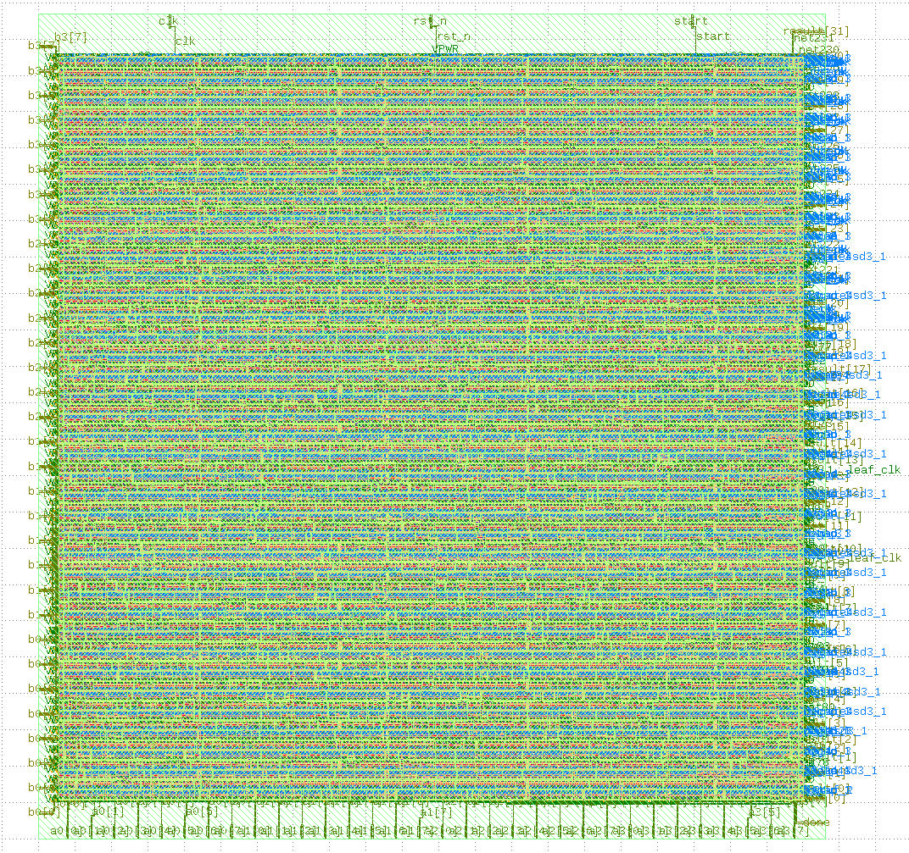
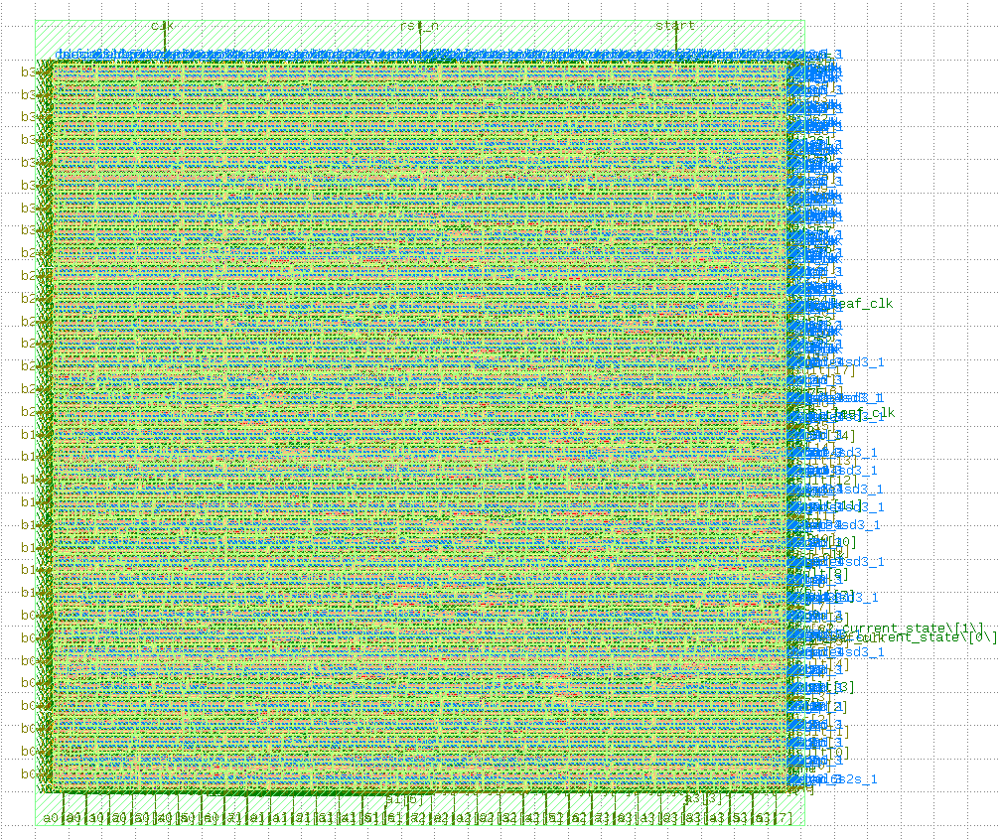

# TinyMAC: RTL-to-GDSII ASIC Design Project

TinyMAC is a personal ASIC physical design portfolio project focused on implementing a small multiply-accumulate accelerator through a complete RTL-to-GDSII flow.

The project includes two versions:

* **TinyMAC v1**: simple single-cycle baseline design.
* **TinyMAC v2**: pipelined version that improves timing and reaches a faster clock target.

The project starts from synthesizable SystemVerilog RTL and covers simulation, synthesis, physical implementation, timing analysis, physical verification, and final GDSII generation using an open-source ASIC flow.

## Project Goal

The goal of TinyMAC is to build and document a small digital hardware block using a realistic ASIC design flow.

The design computes a 4-element unsigned multiply-accumulate operation:

```text
result = a0*b0 + a1*b1 + a2*b2 + a3*b3
```

Each input operand is 8 bits wide. Each multiplication produces a 16-bit product, and the final output result is 32 bits wide.

## Current Project Status

Current status: **TinyMAC v1 and TinyMAC v2 completed through OpenLane/OpenROAD physical design.**

Completed milestones:

* Project environment and GitHub repository setup
* TinyMAC v1 architecture, RTL, lint, simulation, synthesis, and physical design
* TinyMAC v2 pipelined architecture, RTL, lint, simulation, synthesis, and physical design
* Makefile-based automation for v1 and v2 flows
* Yosys synthesis reports and synthesized netlists
* OpenLane/OpenROAD physical implementation for both versions
* Static timing analysis for setup and hold checks
* Clean DRC, LVS, antenna, setup timing, and hold timing results
* Final GDS/DEF/LEF/ODB/netlist view generation
* Real RTL, gate-level, and layout images
* v1 vs v2 timing, area, latency, and signoff comparison

## Design Overview

### TinyMAC v1

TinyMAC v1 is the baseline implementation.

It contains:

* Four 8-bit by 8-bit unsigned multiplier units
* One adder tree for summing four 16-bit products
* One simple control FSM using `start` and `done`
* One 32-bit registered result output

TinyMAC v1 datapath:

inputs -> multipliers -> adder tree -> result register

TinyMAC v1 has lower latency and smaller area, but the full datapath sits in one longer timing path.

### TinyMAC v2

TinyMAC v2 is the pipelined implementation.

It keeps the same external top-level interface, but inserts product registers between the multiplier stage and the adder-tree stage.

TinyMAC v2 datapath:

inputs -> multipliers -> product registers -> adder tree -> result register

TinyMAC v2 increases latency and area, but improves timing closure and reaches a faster clock target.

## Repository Structure

```text
tinymac-rtl-to-gdsii/
├── docs/
│   ├── architecture.md
│   ├── project_log.md
│   └── tinymac_v1_vs_v2_comparison.md
├── rtl/
│   ├── mac_unit.sv
│   ├── adder_tree.sv
│   ├── control_fsm.sv
│   └── tinymac_top.sv
├── rtl_v2/
│   ├── mac_unit_v2.sv
│   ├── adder_tree_v2.sv
│   ├── control_fsm_v2.sv
│   └── tinymac_top_v2.sv
├── tb/
│   └── tinymac_tb.sv
├── tb_v2/
│   └── tinymac_v2_tb.sv
├── scripts/
│   ├── synth.ys
│   ├── synth_v2.ys
│   ├── show_v2_rtl.ys
│   └── show_v2_gate.ys
├── reports/
│   ├── README.md
│   ├── synthesis/
│   ├── synthesis_v2/
│   ├── physical/
│   └── physical_v2/
├── openlane/
│   ├── tinymac/
│   └── tinymac_v2/
├── images/
├── Makefile
├── .gitignore
└── README.md
```

## RTL Modules

### TinyMAC v1 RTL

* `rtl/mac_unit.sv` - combinational 8-bit by 8-bit unsigned multiplier.
* `rtl/adder_tree.sv` - combinational adder tree that sums four products.
* `rtl/control_fsm.sv` - simple control FSM for `result_en` and `done`.
* `rtl/tinymac_top.sv` - top-level module connecting datapath and control.

### TinyMAC v2 RTL

* `rtl_v2/mac_unit_v2.sv` - same multiplier function as v1.
* `rtl_v2/adder_tree_v2.sv` - same adder-tree function as v1.
* `rtl_v2/control_fsm_v2.sv` - pipelined control FSM with product and result enable stages.
* `rtl_v2/tinymac_top_v2.sv` - top-level pipelined design with product registers.

TinyMAC v2 keeps the same external interface as v1, but adds internal pipeline registers to improve timing closure.

## Tools Used

* Ubuntu / WSL2
* Git and GitHub
* VS Code
* SystemVerilog
* Verilator
* GNU Make
* Yosys
* Graphviz
* Docker Desktop with WSL integration
* OpenLane / OpenROAD
* SKY130 open-source PDK
* KLayout

Physical-design tools and outputs used:

* OpenROAD physical implementation
* Static timing analysis reports
* DRC, LVS, and antenna checks
* GDSII, DEF, LEF, ODB, SDF, SPEF, Liberty, and SPICE outputs

## How to Run

### TinyMAC v1

RTL lint:

make lint

RTL plus testbench lint:

make lint-tb

Simulation:

make sim

Synthesis:

make synth

### TinyMAC v2

RTL lint:

make lint-v2

RTL plus testbench lint:

make lint-tb-v2

Simulation:

make sim-v2

Synthesis:

make synth-v2

### OpenLane Physical Design

TinyMAC v1 OpenLane configuration:

openlane/tinymac/config.yaml

TinyMAC v2 OpenLane configuration:

openlane/tinymac_v2/config.yaml

Final OpenLane outputs are stored under each design run directory:

openlane/<design>/runs/<RUN_ID>/final/

### Clean generated simulation files

make clean

## Simulation Results

Both TinyMAC v1 and TinyMAC v2 were verified using directed SystemVerilog testbenches.

The testbenches apply multiple input vectors and check the output automatically.

Passing examples:

TEST PASSED: result=100 expected=100
TEST PASSED: result=300 expected=300
TEST PASSED: result=260100 expected=260100
TEST PASSED: result=700 expected=700

The maximum-value test verifies:

255*255 + 255*255 + 255*255 + 255*255 = 260100

TinyMAC v2 produces the same functional results as v1, but with one extra cycle of latency because of the added pipeline stage.

## RTL-to-GDSII Flow

The same overall ASIC flow was used for both TinyMAC v1 and TinyMAC v2.

```text
Architecture
    ↓
SystemVerilog RTL
    ↓
Verilator Lint
    ↓
SystemVerilog Testbench
    ↓
Functional Simulation
    ↓
Makefile Automation
    ↓
Yosys Synthesis
    ↓
OpenLane / OpenROAD Physical Design
    ↓
Floorplanning
    ↓
Placement
    ↓
Clock Tree Synthesis
    ↓
Routing
    ↓
DRC / LVS / Antenna / Timing Signoff
    ↓
Final GDSII
```

## Physical Design Results

Both TinyMAC v1 and TinyMAC v2 completed the OpenLane/OpenROAD physical design flow using the SKY130 open-source PDK.

### TinyMAC v1 Final GDS Layout



### TinyMAC v1 Physical Results

| Metric | Value |
|:---:|:---:|
| Target clock period | 25 ns |
| Approx. frequency | 40 MHz |
| Standard-cell count | 2301 |
| Standard-cell area | 12668.4 um^2 |
| Die area | 49024.7 um^2 |
| Core area | 41758.8 um^2 |
| Setup worst slack | +0.9228 ns |
| Hold worst slack | +0.2664 ns |
| Route DRC errors | 0 |
| Magic DRC errors | 0 |
| Antenna violating nets | 0 |

Detailed v1 summary:

reports/physical/tinymac_openlane_summary.md

### TinyMAC v2 Final GDS Layout



### TinyMAC v2 Physical Results

| Metric | Value |
|:---:|:---:|
| Target clock period | 10.5 ns |
| Approx. frequency | 95.24 MHz |
| Standard-cell count | 2607 |
| Standard-cell area | 15826.4 um^2 |
| Die area | 55955.6 um^2 |
| Core area | 47845.9 um^2 |
| Setup worst slack | +0.195984 ns |
| Hold worst slack | +0.261731 ns |
| Setup violations | 0 |
| Hold violations | 0 |
| Route DRC errors | 0 |
| Magic DRC errors | 0 |
| KLayout DRC errors | 0 |
| LVS errors | 0 |
| Antenna violating nets | 0 |
| Total power | 0.004670 W |

Detailed v2 summary:

reports/physical_v2/tinymac_v2_physical_summary.md

Detailed v1 vs v2 comparison:

docs/tinymac_v1_vs_v2_comparison.md

## Key Learning Outcomes

This project connects digital RTL design with physical ASIC implementation:

* RTL design and module-level hierarchy
* Verilator linting and testbench-based simulation
* Yosys synthesis from RTL to gate-level logic
* Generic gates versus SKY130 standard cells
* OpenLane/OpenROAD RTL-to-GDSII physical implementation
* Floorplanning, placement, clock tree synthesis, and routing
* DEF inspection for placed cells, pins, power nets, and routed signal nets
* GDSII layout inspection using KLayout
* Timing closure using setup and hold slack
* Physical verification using DRC, LVS, and antenna checks
* Pipeline design as a timing-improvement technique
* ASIC tradeoffs between area, latency, and clock frequency
* Comparison of a baseline design against a pipelined implementation

## Planned Next Steps

The main TinyMAC v1 and v2 technical flows are complete.

Remaining project-polish tasks:

* Review the GitHub presentation from a visitor perspective
* Update `docs/project_log.md` with the completed v2 work
* Check that README links, report paths, and image paths render correctly
* Prepare a concise LinkedIn post about the project
* Prepare a short CV bullet and interview explanation for TinyMAC

## Author

Mourice Kaloush
